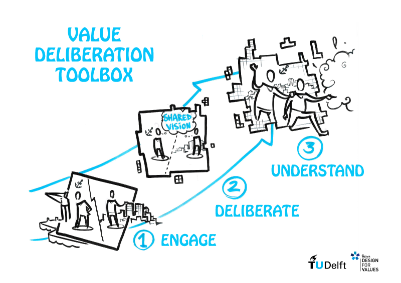

# Value Deliberation Toolbox

Our societies often face complex problems where there are many differing views on how to resolve them. Sometimes, different individuals or groups might even have conflicting objectives for these problems. For example, high stakes policy programs like the energy transition and large infrastructure projects involve many stakeholders with a wide gamut of perspectives. We present a new (novel) methodology to accelerate the strategizing process by helping stakeholders understand each other’s values that they associate with different solutions to the problem.

Beyond more traditional approaches, research has shown that participants may cooperate if they understand each other’s values and why they prefer certain solutions. By discussing their values with one another, they may see more commonalities with each other or empathize for others’ concerns that they might have dismissed before. Our framework allows a facilitator to guide conflicting participants towards commonly agreeable strategies by encouraging a value-based discussion between the participants.

The process works best where there are distinct strategies and participants are willing to listen to, work with, and cooperate with one another.  The overall objective is for them to better understand each other and become more willing to cooperate.

## The Toolbox

The zip file includes:

* Poster – helps compile and organize participants' arguments and values
* Organizer's Guide – same information as in [here](organizers.md) but in a printable format
* Facilitator's Guide – printed document for facilitators
* Ranking calculator – Excel template for quickly calculating the overall rankings

## Features and Roles

The Value based Deliberation toolbox has been successfully applied to the Port-City futures conference held at TU Delft in November 2018 and some other events and summits too. Different stakeholders from academia, industry, ports, and municipalities participated in the conference to deliberate about energy transition scenarios for the port of Rotterdam.

## Learn More

1. Pigmans, K., Dignum, V., & Doorn, N. (2019). Group proximity and mutual understanding: Measuring onsite impact of a citizens’ summit. Journal of Public Policy, 1-23. doi:[10.1017/S0143814X19000230](https://doi.org/10.1017/S0143814X19000230)

## Contact

* Klara Pigmans ([K.A.M.Pigmans@tudelft.nl](mailto:K.A.M.Pigmans@tudelft.nl))
* Tino Mager ([B.T.Mager@tudelft.nl](mailto:B.T.Mager@tudelft.nl))
